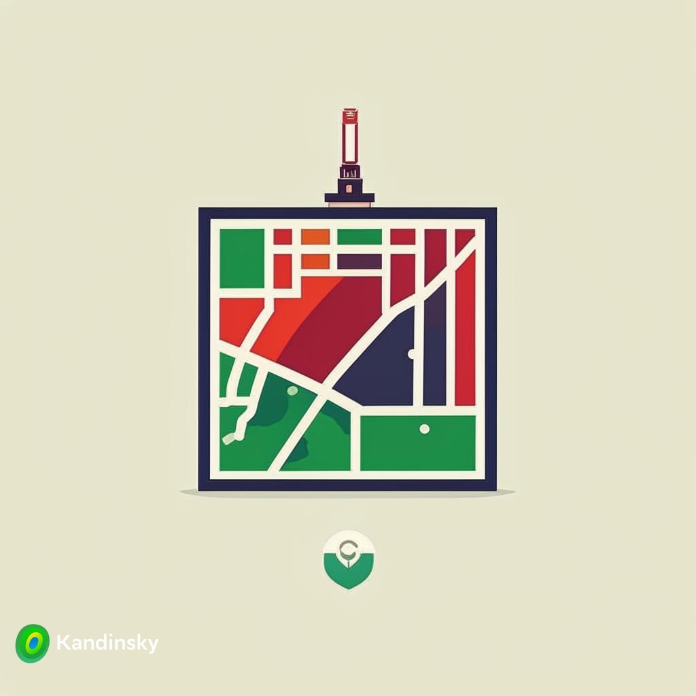

# MapBashkortostanCulture-MobileApp
This project, a mobile application was developed, the main task was the use of GIS technologies, namely: working with an area map, creating beacons on an arbitrary set of locations, establishing integration with existing platforms for tracking the position of a smartphone and helping the user navigate the area. From this task grew the idea of ​​creating a resource with information about the main cultural centers of the capital of the Republic of Bashkortostan, Ufa. In this application you can find background information about the theaters and museums of the city, determine your location in the city and get directions to the desired cultural center.

## Сontents
- [Technologies](#technologies)
- [Using](#using)
- [Documentation](#documentation)
- [Distribute](#distribute)
- [Developers](#developers)
- [Contributing](#contributing)
- [License](#license)

## Technologies
- [Kotlin](https://kotlinlang.org/)
- [Java](https://www.java.com/ru/)
- [Google maps API](https://developers.google.com/maps)
- ...

## Using
The mobile application was developed using the Android Studio IDE. To reproduce the results and compile the project, you need to download this GitHub project and build it in the Android Studio environment. If errors occur, you need to check the generated paths in the project, as well as the operation of the API maps.

## Documentation
Unfortunately, detailed documentation for this project has been lost. 😭

Therefore, if you have any problems working with it, you can directly contact the creator's [email](https://mail.google.com/mail/?view=cm&fs=1&to=korovinevgeniyalexeyevich@gmail.com&su=MapBashkortostanCulture-MobileApp). 📧

In the future, I will try to restore the accompanying documentation and attach it to the project with a new commit. In case I forget to change the README.md, the documentation will be added to the folder - [Report](Report). 🛠️

## Distribute
- [GitHub repository](https://github.com/EvgeniyKorovin1/MapBashkortostanCulture-MobileApp)

## Developers
- [Evgeniy Korovin](https://github.com/EvgeniyKorovin1)

## Contributing
To send feedback on the project or other interaction that can be associated with it, please use [email](https://mail.google.com/mail/?view=cm&fs=1&to=korovinevgeniyalexeyevich@gmail.com&su=MapBashkortostanCulture-MobileApp), indicating the [repository](https://github.com/EvgeniyKorovin1/MapBashkortostanCulture-MobileApp) as the subject of the letter.

## License
The license for the use of materials from this project can be viewed - [LICENSE](LICENSE).
